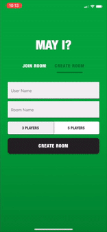

## MayI? Card Game 

May I is a multiplayer card game with similar rules to Rummy.  I am not exactly sure the origins of this version of the game but it is unlike anything I could find online.  The exact rule set used in this variation is the one I grew up with at family functions.  The games objective is for each player to group their cards together to satisfy the rounds melding requirements (a meld is a required number of groups/sets of cards, acheiving your meld allows you to get rid of the cards from your hand) in order to have the lowest total card value at the end of each round and ultimately the game.

## Project Status
The project is still being developed. Built with react-native the game has been end-to-end tested on the latest versions of ios.  Users should be able to play through an entire game on ios with little to no issues.  However, there is much more testing and inevitably some bug fixes that will continue to be developed.

## Project Screen Shot(s)

Video Link:
https://youtu.be/dTn7_qRHsFs

## Reflection

The goal of this side project was two-fold.  I wanted to get a better understanding of React Native, SocketIO, and the overall software development process on relatively larger and more dynamic projects while building something meaningful and useable (specifically for my friends and family).

I set out to build the game with the exact rule set that was used by my family.  I also wanted to make sure the UI was very simple and straightforward for my older family members that are not very tech savvy.  I envisioned the way it would be played around a dinning room table and attempted to mimic that experience.

I've ran into many challenging while building the app.  Using panResponder to record gestures and handle drag and drop across many components was something I had to meticulously map out.  In addition, coding specific game rules that had many nuance edge cases was challenging but ultimately accomplished.  Lastly, handling timers from the server to the client to achieve a synced game clock was a much more difficult task than I had imagined.

Ultimately, I learned a lot and got some good experience using a bunch of tools and libraries.  I used Expo for application setup, React Native, Node, and SocketIO as core technologies and any many helper libraries including react-navigation, react-native-paper, and react-native-confetti-cannon. 
